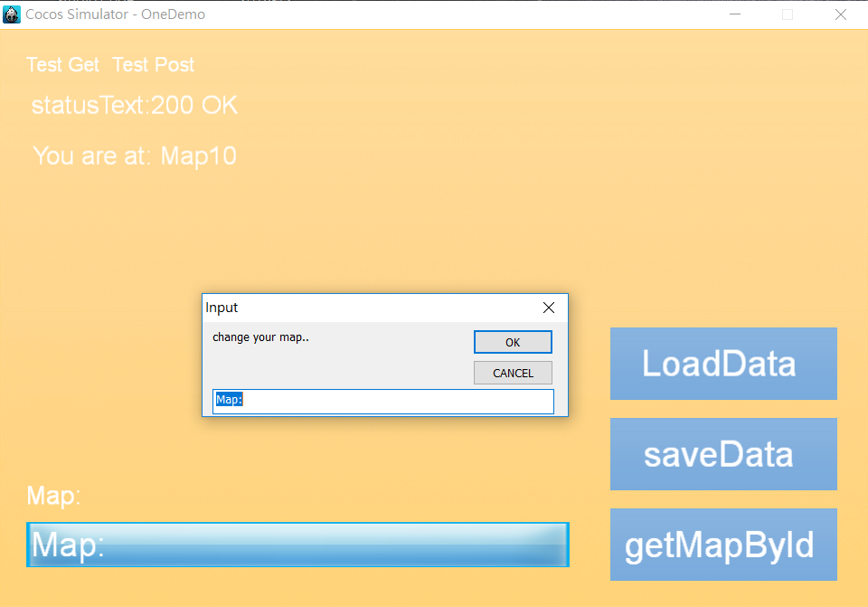
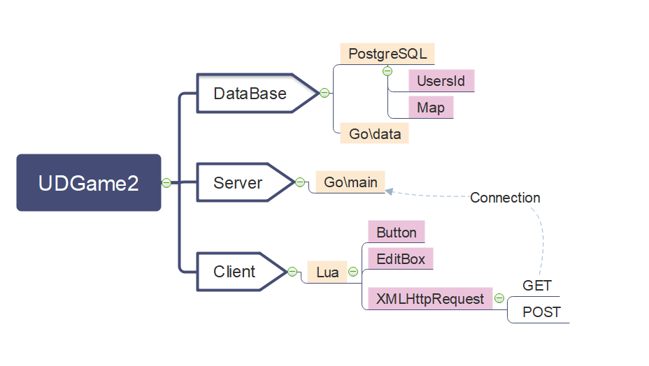
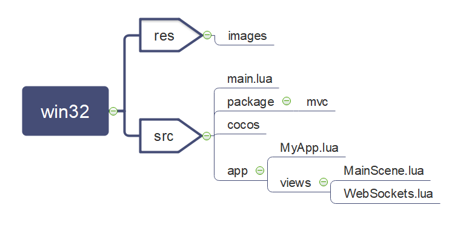

## Cocos2D-x Lua用戶端與Golang伺服端連線資料整合實作(Cocos2D-x3.10 Lua & Golang)

* 本實作延續[前次實作](https://github.com/mopack/ChatRoomProgram)，
有鑑於前作WebView在Win32與Android(.apk)上的不支援性，本實作試圖重新改寫前次實作，
以Cocos Studio製作UI，Visual Studio 2013引出建置專案，並以Lua腳本拓寫客戶端。
服務器端則沿用前次實作的Golang與PostgreSQL。

* 本實作製作出的Win32執行檔可以以HTTP協議與服務器端設置GET/POST協議，並
有實作出按鈕Button、輸入框EditBox、標籤Label等輸入/輸出顯示功能。未來稍後
能以此介面，與服務器端發展出資料庫輸出入的設定，如此一來遊戲的輸出入也能以此
模擬。之後能將此實作製作成封包，對於未來使用上更加的方便。

## 成果展示

 

## 網路架構

 

## 程式架構

## Cocos控制項

本次實作使用如下控制項(Lua語法)：

* Layer
* Sprite
* Scale9Sprite
* Button
* EditBox
* Menu
* XMLHttpRequest

## 後續展望

* 順利實作完Lua Client存取Golang Server的功能
* 將此功能加入至下次實作的戰鬥動作之中，如 getMapbyID => getHPbyID
* 最後能發展成Lua引擎功能的預先製作封包，便利後續使用